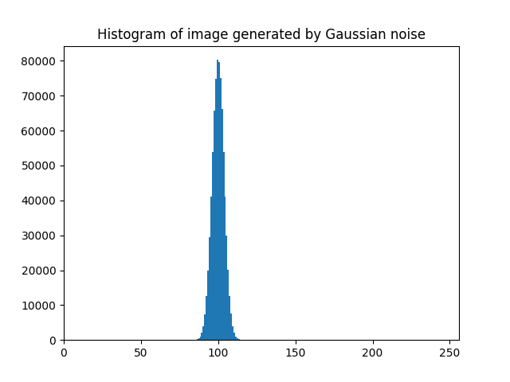

# Gaussian Noise

> AUthor : Ya Chen 
> Date : 2021 / 4 / 26

---

 

## Description

1. Create an image g(x,y) whose pixels all have the same gray value of 100. Show the image g(x,y).
2. Generate Gaussian noise n(x,y), with <b>μ = 0, σ2 = 15,</b> using the algorithm shown following. 

> ### Algorithm : Generation of zero mean Gaussian noise
>
> 1.  Suppose an image has gray-level range |0, G-1|. Select σ > 0;
> 2.  For eah pair of horizontally neighboring pixels (x, y), (x, y+1) generate a pair of uniform random numbers γ, φ in the range [0, 1].
> 3.  Calculate z1 = σ _ cos(2πφ) _ sqrt(-2 _ ln γ), &emsp;z2 = σ _ sin(2πφ) _ sqrt(-2 _ ln γ)
> 4.  Set f'(x, y) = g(x, y) + z1 and f'(x, y+1) = g(x, y+1) + z2, where g is the input image.
> 5.  Set &emsp;&emsp;&emsp;| = 0 &emsp;&emsp; if f'(x, y) < 0,  >&emsp;&emsp;f(x, y) | = G -1 &emsp;if f'(x, y) > G - 1,   >&emsp; &emsp; &emsp;&emsp;| = f'(x, y)&emsp;otherwise   >&emsp; &emsp; &emsp; &emsp;&emsp;| = 0 &emsp;&emsp; if f'(x, y+1) < 0,  >&emsp;&emsp;f(x, y+1) | = G -1 &emsp;if f'(x, y+1) > G - 1,   >&emsp; &emsp; &emsp; &emsp;&emsp;| = f'(x, y+1)&emsp;otherwise 
>     Show the noisy image f(x,y) = g(x,y) + n(x,y). 
> 6.  Go to 3 until all pixels have been scanned.

3. Display the histogram h(i) of f(x,y).
4. Comment on your results.

 
 

## In-Output Example

### Input:

&emsp;&emsp; Original Image : 
&emsp;&emsp;&emsp;&emsp;&emsp;&emsp;&emsp;&emsp;&emsp;&emsp;

### Output:

&emsp;&emsp; Image-generated-by-Gaussian-noise : 
&emsp;&emsp;&emsp;&emsp;&emsp;&emsp;&emsp;&emsp;&emsp;&emsp;

&emsp;&emsp; Histogram-of-image-generated-by-Gaussian-noise : 
&emsp;&emsp;&emsp;&emsp;&emsp;&emsp;&emsp;&emsp;&emsp;&emsp;

